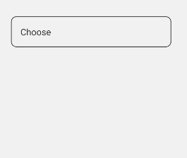

# DropdownField
The DropdownField component is a control that allows users to select a single option from a dropdown list.

## Usage
DropdownField is included in the `UraniumUI.Material.Controls` namespace. You should add it to your XAML like this:

```xml
xmlns:material="http://schemas.enisn-projects.io/dotnet/maui/uraniumui/material"
```

Then you can use it like this:

```xml
<material:DropdownField Title="Pick an option" ItemsSource="{Binding Items}" />
```

| Light (Android) | Dark (Windows) |
| --- | --- |
|  |  |


## Icon
DropdownFields support setting an icon on the left side of the control. You can set the icon by setting the `Icon` property. The icon can be any `ImageSource` object. FontImageSource is recommended as Icon since its color can be changed when focused.

```xml
<material:DropdownField 
    Title="Pick an option"
    ItemsSource="{Binding Items}"
    Icon="{FontImageSource FontFamily=MaterialRegular, Glyph={x:Static m:MaterialRegular.Expand_circle_down}}"
    />
```


> [!TIP]
> You can use any `ImageSource` object as Icon. But `FontImageSource` is recommended as it can change its color when focused.
> Refer to the [Icons Documentation](../../../theming/Icons.md) for more details on using icons.


## AllowClear
DropdownFields support clearing the selected item by setting the `AllowClear` property to `true`. Default value is `true`. You can make it `false` to disable clearing.

```xml
<material:DropdownField 
    Title="Pick an option (Clearable)"
    ItemsSource="{Binding Items}"
    AllowClear="True" />

<material:DropdownField
    Title="Pick an option (Unclearable)"
    ItemsSource="{Binding Items}"
    AllowClear="False" />
```

## Validation
DropdownFields support validation rules. **SelectedItem**_(object)_ will be used to validate the control. You can set the `Validations` proeprty to add validation rules. Default

```xml
<material:DropdownField 
    Title="Pick an option"
    ItemsSource="{Binding Items}"
    Icon="{FontImageSource FontFamily=MaterialRegular, Glyph={x:Static m:MaterialRegular.Expand_circle_down}}">
    <material:DropdownField.Validations>
        <validation:RequiredValidation />
    </material:DropdownField.Validations>
</material:DropdownField>
```
